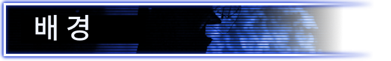
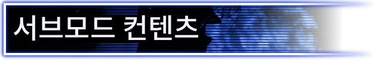
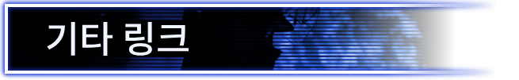

# The Fire Rises: Flags Unfurled Demo - Korean Translation

**The Fire Rises: Flags Unfurled Demo의 한국어 번역 모드입니다.**

이 모드는 The Fire Rises의 서브모드인 **Flags Unfurled Demo**에서 추가되는 컨텐츠를 한국어로 번역합니다.
TFR 본편의 번역은 포함하지 않으며, TFR 본편 한국어 번역 모드에 의존합니다.

## 필수 모드

* The Fire Rises
* The Fire Rises: Flags Unfurled Demo
* The Fire Rises Korean Translation

## 권장 로드 순서

1. The Fire Rises
2. The Fire Rises: Flags Unfurled Demo
3. 타오르는 불길 한글패치
4. 이 모드

## 원본 모드 설명

다음은 원본 모드 설명입니다.

때는 2020년. 내전과 테러리즘이 각국을 불태우는 가운데, 강대국들은 국제법 따위는 아랑곳하지 않은 채 세계를 손안의 장난감처럼 주무르고 있습니다. 국제 안정의 수호자인 유엔은 이제 자문 기구 이상의 역할을 하지 못합니다. 비효율적이고 수동적인 조직으로 취급받는 유엔은, 그 재정을 부담하는 대중으로부터 점점 더 많은 의심과 비판을 받고 있습니다.

전 세계에서 치명적인 팬데믹, 경제 위기, 국제적 유대의 붕괴가 국경을 넘어 인류 공동의 선을 추구한다는 유엔의 이상에 도전하고 있습니다. 불안정의 화염이 미국을 집어삼키자, 그 안에서 새로운 경계가 생겨나며 주와 도시, 이웃 공동체마저 갈라놓습니다. 유엔은 뉴욕에서 쫓겨나 제네바로 향하게 되고, 많은 국제 관측통들은 이것이 유엔의 영향력, 만약 그런 것이 존재하기는 했다면, 그 종말이라고 여겼습니다.

**그러나 그렇지 않았습니다.**

깃발이 펼쳐지고, 평화유지군이 앞으로 진군합니다. 80년 동안 이어져 온 법과 외교의 국제 질서는 끝났고, 인간들 사이의 내전은 다시금 대서양에서 태평양까지 불타오릅니다. 당신은 모든 인류를 위한 새로운 공동의 비전을 찾아야 하며, 혼돈과 폭력을 헤쳐 나아가야 하고, 하나의 푸른 깃발 아래 새로운 세계 질서를 벼려내야 합니다. 유엔은 단지 평화를 지키기 위해 이곳에 있는 것이 아닙니다. 유엔은 이곳에 남기 위해 왔습니다.

The Fire Rises: Flags Unfurled는 The Fire Rises의 틀 안에서 플레이어에게 색다른 유엔을 선보입니다. 미국 개입 과정에서 무력 분쟁을 대하는 유엔의 태도가 결정적인 전환점을 맞이하며, 완전히 새로운 경험을 제공합니다. 플레이어는 조직의 육신인 평화유지군, 혹은 조직의 영혼인 헌장 중 어느 쪽에 초점을 맞출지 선택하여 유엔을 서로 다른 길로 이끌고, 인류의 운명을 결정할 수 있습니다.

이 서브모드는 다음 컨텐츠를 추가합니다.

* 플로리다에 대한 유엔 컨텐츠
* 미국 통일에 대한 유엔 컨텐츠
* 고유 플레이버 이벤트
* 고유 슈퍼 이벤트
* 유엔 전용 고유 GFX
* 유엔의 첫 번째 및 두 번째 중점 계통도
* 유엔 준비 및 작전 결정
* 유엔 전용으로 개편된 기술 계통도
* 유엔 권력 균형 메커니즘

물론 앞으로 더 많은 것들이 추가될 예정입니다. 이것은 시작에 불과합니다.....

Discord 링크: https://discord.gg/Xz2gpXnWsv

Discord 서버의 모든 멤버와 개발팀 여러분께 특별한 감사를 드립니다. 이 프로젝트를 응원해 주신 모든 분들께 감사드립니다!

## 제보 및 수정 제안

오역, 누락, 문장 깨짐, 원본 모드 업데이트로 인한 문제는 댓글 또는 GitHub Issues로 제보해 주세요.

## Steam 창작마당

[Steam Workshop](https://steamcommunity.com/sharedfiles/filedetails/?id=3749809096)
